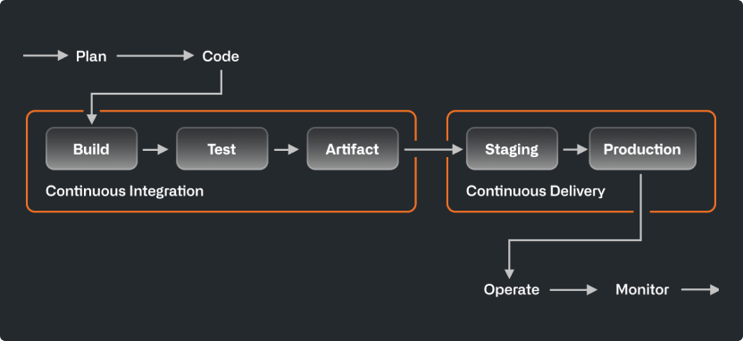

# CI/CD Pipeline

### What is a CI/CD Pipeline?

A Continuous Integration/Continuous Delivery (CI/CD) pipeline is a set of automated processes that enable developers to deliver software updates more frequently and securely.

There are typically six components to a CI/CD pipeline:

* Source Control Management (SCM)
* Automated Testing
* Artifact Repository
* Deployment Automation
* Monitoring and Feedback

This manual will talk about these components more as it progresses.

There are generally three main stages to a CI/CD pipelines: Build, Test, Deploy. However, you may see some companies split them into five or more steps as seen below, depending on the use they want from their pipeline.

To read more about CI/CD pipelines, read [here](https://resources.github.com/ci-cd/)

### CI/CD Pipeline Environment

**Ubuntu DevContainer**:

The DevContainer this project uses runs using the Ubuntu operating system. It is a containerized development environment already configured with the appropriate dependencies, tools, SDKs, and other configurations necessary to successfully develop and run Flutter applications.

>To learn more about DevContainers, click [here](https://code.visualstudio.com/docs/devcontainers/create-dev-container)
>
>To read more about the specific DevContainer configured for this project, click [here](/documentation/DevContainer.md)

**Docker**:

Docker is utilized in this project to containerize the development environment to provide consistency across devices, preventing the "well it works on my device" dilemma. By using a Docker Image, this allows the Ubuntu DevContainer to run smoothly without providing any issues related to the environment. 

>To learn more about Dockers, click [here](https://www.docker.com/)
>
>To read more about the specific Docker Image utilized in this project's DevContainer, click [here](/documentation/DevContainer.md)

**Git and GitHub** :

Git is used in this project as version control system. Through the use of Git, the project can be integrated frequently and reliably. Using this system provides tracking for any changes made to code. 

GitHub is the version control platform used for this project that hosts Git repositories, as well as providing many useful features including issue tracking, easy collaboration with developers, and pull requests.

>To learn more about Git, click [here](https://git-scm.com/)
>
>To learn more about GitHub, click [here](https://github.com/github)
>
>To read more about the use of Git in this specific project, click [here](/documentation/VersionControl.md)

**Network Configurations**:

##### CI/CD Network Configurations

Internet Access: The CI/CD pipeline requires internet access to interact with external services such as GitHub (for version control), Docker Hub or other container registries (for storing Docker images), and any third-party dependencies or libraries needed during the build, test, and deployment processes.

##### DevContainer Network Configurations

Devcontainer Communication: The devcontainer running Ubuntu within Docker needs network connectivity to communicate with other services, including the CI/CD pipeline components, such as the CI server (e.g., GitHub Actions runner) and any external services or APIs required by the pipeline.
Inter-Container Communication: If the CI/CD pipeline utilizes multiple containers (e.g., for running tests in isolated environments), Docker provides networking capabilities to facilitate communication between these containers. Docker's default bridge network allows containers to communicate with each other within the same host.

##### GitHub Network Configurations

Outbound Traffic: The devcontainer must be able to initiate outbound connections to GitHub over HTTPS or SSH protocols to clone/pull the code repository, push changes, and interact with GitHub APIs for features like creating pull requests or commenting on issues.

>**Why Do Network Configurations Matter?**
>
>By ensuring proper network configurations, the CI/CD pipeline can seamlessly interact with version control systems like GitHub, pull code, trigger automated build and deployment processes within Docker containers, and access any required external services or dependencies to facilitate continuous integration and continuous delivery workflows.

### CI/CD Pipeline Tools:

#### GitHub Actions

**Features**:

*Native Integration with GitHub*: GitHub Actions is tightly integrated with GitHub repositories, making it easy to set up and manage workflows directly within the GitHub UI.

*YAML-Based Configuration*: Workflows are defined using YAML syntax, which provides a simple and declarative way to specify the steps and actions to be executed.

*Extensive Marketplace of Actions*: GitHub Actions provides a marketplace where users can discover and use pre-built actions created by the community or third-party vendors. These actions cover a wide range of use cases, from building and testing applications to deploying to various cloud platforms. This was especially helpful in this project because of the availability of a templated Docker Image YAML file.

*Event-Driven Triggers*: Workflows can be triggered by various GitHub events, such as push events, pull request events, issue comments, and repository dispatch events. This flexibility enables automation based on specific triggers and events in the repository.

**Strengths**:

*Seamless Integration with GitHub*: As described above, GitHub Actions is seamlessly integrated with GitHub repositories, eliminating the need for external CI/CD services or additional setup. This simplifies the workflow and reduces complexity.

*YAML-Based Configuration*: As described above, the YAML-based configuration makes it easy to define and version control workflows alongside the codebase, ensuring consistency and reproducibility across environments.

*Community and Ecosystem*: GitHub Actions has a vibrant community and ecosystem of developers contributing actions and sharing best practices. Users can leverage the marketplace to discover and reuse actions for common tasks, accelerating development workflows.

**Limitations**:

*Complexity for Advanced Workflows*: While GitHub Actions is suitable for many use cases, complex or highly customized workflows may require additional configuration and scripting, which can introduce complexity.

*Resource Limitations*: The free tier of GitHub Actions imposes certain limitations on resource usage, such as execution time limits and concurrency limits, which may impact larger or resource-intensive workflows.

> To learn more about GitHub Actions, click [here](https://docs.github.com/en/actions)

### Automation Process:

**1. Code Commit/Trigger:**
Developers push code changes to the Git repository hosted on GitHub.
This triggers the CI/CD pipeline to start executing.

**2. Checkout:**
The pipeline retrieves the latest version of the codebase from the GitHub repository.

**3. Build:**
The pipeline spins up the Ubuntu devcontainer using Docker.
It executes build scripts within the devcontainer to compile the code.
The output of the build process may include binaries, executable files, or other artifacts needed for testing and deployment.

**4. Unit Testing:**
Automated unit tests are executed within the devcontainer to validate individual units or components of the codebase.
Test results are collected and analyzed to ensure code quality and functionality.

**5. Integration Testing:**
The pipeline deploys the application to a testing or staging environment within the devcontainer.
Integration tests are executed to verify that different components of the system work together correctly.
This stage may involve testing interactions between modules, services, or external dependencies.

**6. Deployment to Staging Environment:**
If all tests pass successfully, the pipeline deploys the application to a staging environment for further testing and validation.
The staging environment closely resembles the production environment but may have some differences (e.g., smaller scale, different data).

**7. Deployment to Production Environment:**
After successful testing and approval, the pipeline automatically deploys the application to the production environment.
Deployment scripts within the CI/CD configuration automate the process of provisioning infrastructure, configuring services, and deploying the application.
The production environment is the live environment where end-users interact with the application.
**8. Monitoring and Feedback:**
Continuous monitoring of the deployed application provides feedback to developers and operations teams.
Monitoring tools detect and alert on any issues or anomalies in production, enabling rapid response and troubleshooting.

> **To learn more about the automation process, click on the links below!**
>
> [Continuous Delivery Pipeline: The 5 Stages Explained](https://codefresh.io/learn/continuous-delivery/continuous-delivery-pipeline-the-5-stages-explained/#:~:text=A%20continuous%20deployment%20pipeline%20deploys%20the%20build%20automatically,requires%20connecting%20to%20error%20reporting%20and%20ticketing%20tools.)
>
> [CI/CD pipelines explained: Everything you need to know](https://www.techtarget.com/searchsoftwarequality/CI-CD-pipelines-explained-Everything-you-need-to-know)
>
> [From Code to Production: A Comprehensive Practical Guide to CI/CD Pipelines](https://romanglushach.medium.com/from-code-to-production-a-comprehensive-practical-guide-to-ci-cd-pipelines-ad3669f40ce0)
>
